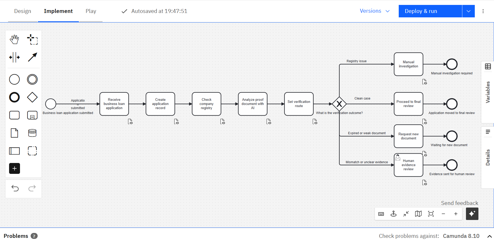
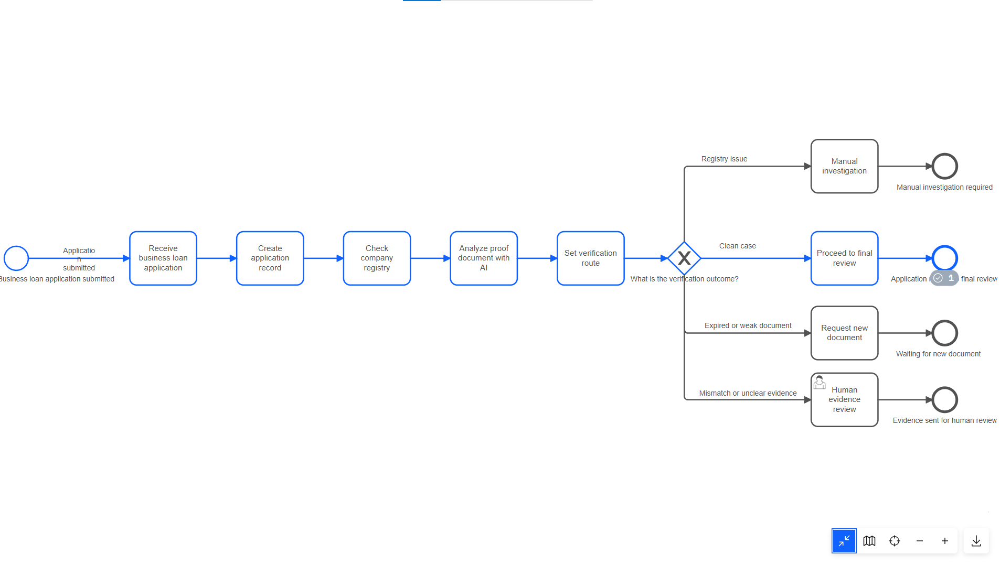
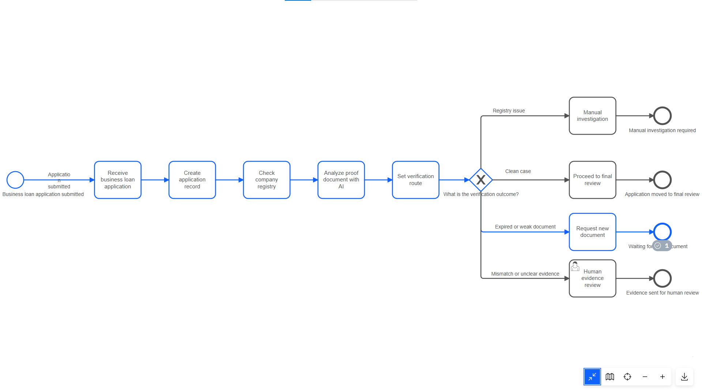
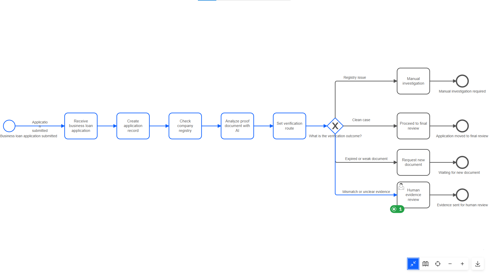
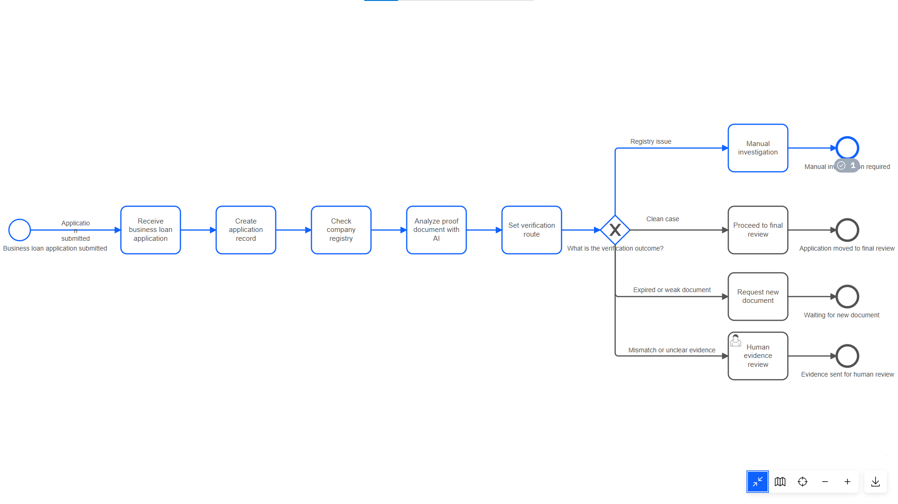
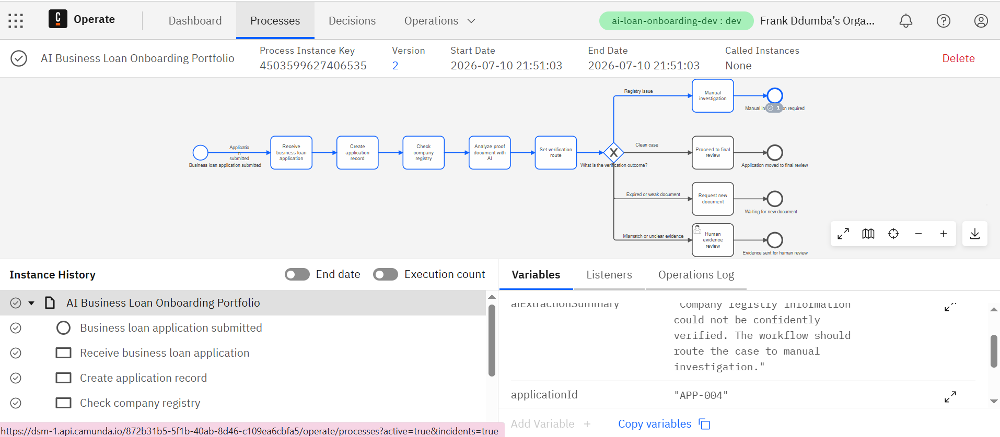
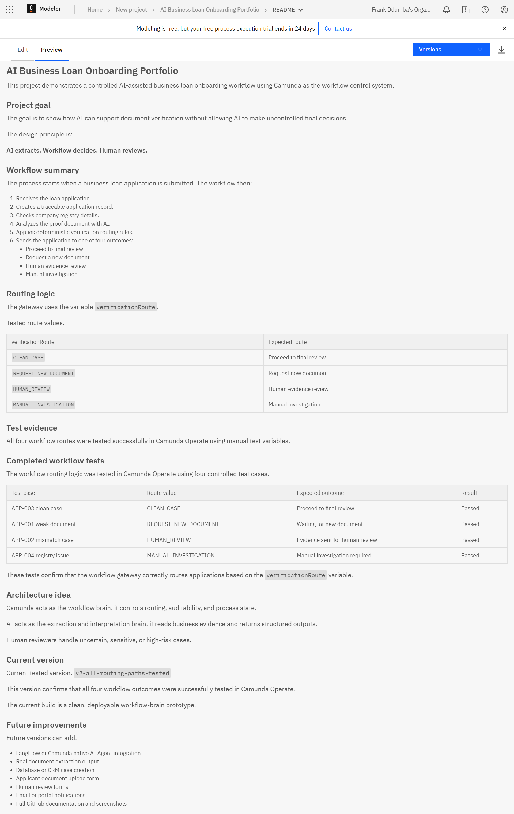
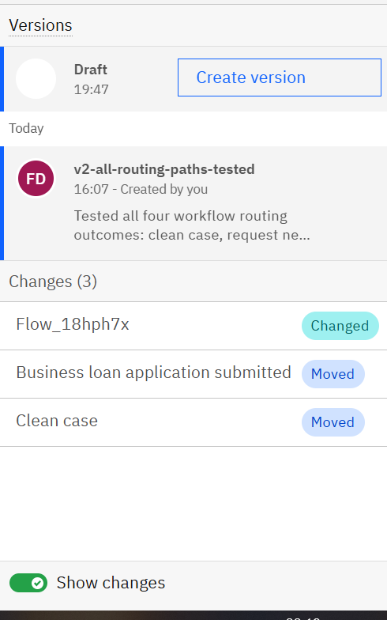

# AI Business Loan Onboarding Portfolio

This project demonstrates a controlled AI-assisted business loan onboarding workflow using Camunda as the workflow control system.

## Project goal

The goal is to show how AI can support document verification without allowing AI to make uncontrolled final decisions.

The design principle is:

**AI extracts. Workflow decides. Human reviews.**

## Workflow summary

The process starts when a business loan application is submitted. The workflow then:

1. Receives the loan application.
2. Creates a traceable application record.
3. Checks company registry details.
4. Analyzes the proof document with AI.
5. Applies deterministic verification routing rules.
6. Sends the application to one of four outcomes:
   - Proceed to final review
   - Request a new document
   - Human evidence review
   - Manual investigation

## Routing logic

The gateway uses the variable `verificationRoute`.

Tested route values:

| verificationRoute | Expected route |
|---|---|
| `CLEAN_CASE` | Proceed to final review |
| `REQUEST_NEW_DOCUMENT` | Request new document |
| `HUMAN_REVIEW` | Human evidence review |
| `MANUAL_INVESTIGATION` | Manual investigation |

## Test evidence

All four workflow routes were tested successfully in Camunda Operate using manual test variables.

## Completed workflow tests

The workflow routing logic was tested in Camunda Operate using four controlled test cases.

| Test case | Route value | Expected outcome | Result |
|---|---|---|---|
| APP-003 clean case | `CLEAN_CASE` | Proceed to final review | Passed |
| APP-001 weak document | `REQUEST_NEW_DOCUMENT` | Waiting for new document | Passed |
| APP-002 mismatch case | `HUMAN_REVIEW` | Evidence sent for human review | Passed |
| APP-004 registry issue | `MANUAL_INVESTIGATION` | Manual investigation required | Passed |

These tests confirm that the workflow gateway correctly routes applications based on the `verificationRoute` variable.

## Screenshots

### Full BPMN workflow

### Clean case route

### Request new document route

### Human review route in Tasklist

### Manual investigation route

### Operate variables

### README preview

### Process version success

## Architecture idea

Camunda acts as the workflow brain: it controls routing, auditability, and process state.

AI acts as the extraction and interpretation brain: it reads business evidence and returns structured outputs.

Human reviewers handle uncertain, sensitive, or high-risk cases.

## Current version

Current tested version: `v2-all-routing-paths-tested`

This version confirms that all four workflow outcomes were successfully tested in Camunda Operate.

The current build is a clean, deployable workflow-brain prototype.

## Future improvements

Future versions can add:

- LangFlow or Camunda native AI Agent integration
- Real document extraction output
- Database or CRM case creation
- Applicant document upload form
- Human review forms
- Email or portal notifications
- Full GitHub documentation and screenshots