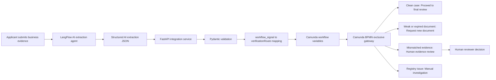

# Architecture Diagram

This document provides a visual overview of the AI Business Loan Onboarding Portfolio project.

## System architecture

## Responsibility separation

| Component | Responsibility |
|---|---|
| Applicant | Submits business evidence |
| LangFlow AI extraction agent | Extracts facts from the document |
| FastAPI integration service | Validates JSON and maps signals |
| Camunda | Controls workflow routing |
| Human reviewer | Handles uncertain or mismatched evidence |

## Core design principle

AI extracts. Workflow decides. Human reviews.

## Why this architecture matters

This architecture prevents AI from making uncontrolled business decisions.

The AI layer produces structured evidence.

The FastAPI layer validates and maps the evidence.

Camunda controls the workflow route.

Human reviewers handle sensitive or uncertain cases.